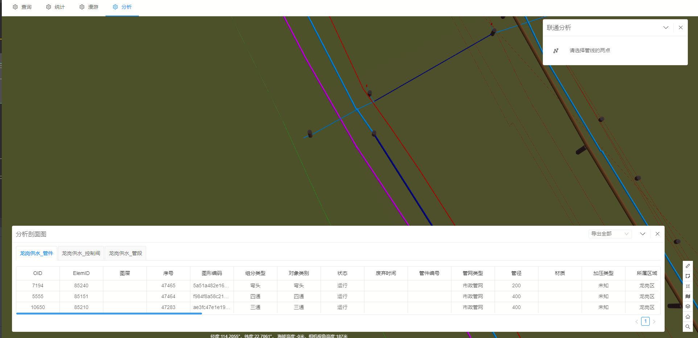

# 连通分析

> municipal-connect 连通分析组件，用于查询点击的两个管点之间所有的管线与管点信息

## 效果一览




## 基本用法

> 基本的连通分析组件用法，需要通过queryConnect回调，来获取连通分析查询参数

```vue
<template>
  <div>
    <municipal-connection @queryConnect="queryConnect"></municipal-connection>
    <municipal-result-common title="分析剖面图" :panelPosition="panelPosition"
                             @onClose="resultVisible=false"
                             :load="load"
                             v-if="resultVisible"
                             :tabs="tabs"
    ></municipal-result-common>
  </div>
</template>

<script>
import Store from '@/store/store';

export default {
  name: "ConnectionAna",
  data() {
    return {
      panelPosition: 'bottom',
      resultVisible: false,
      load: false,
      tabs: []
    };
  },
  methods: {
    async queryConnect(param) {
      const store = new Store;
      this.resultVisible = true;
      this.load = true;
      const {mapServerName, layerId0, layerId1, objectId0, objectId1} = param;
      const {tabs} = await store.connectionJudgeNew(mapServerName, {layerId0, layerId1, objectId0, objectId1});
      if (tabs?.length) {
        this.tabs = tabs;
      } else {
        this.$message.warn('未查询到联通分析数据');
      }
      this.load = false;
    }
  }
};
</script>
```

## 属性

### 属性说明

属性|说明|取值类型|默认值
--|:--:|:--:|:--:
vueKey|municipal-web-scene组件的 ID，当使用多个mapgis-web-scene组件时，需要指定该值，来唯一标识mapgis-web-scene组件|String|default vueIndex|当
vueIndex|municipal-web-scene 插槽中使用了多个相同组件时，例如多个 municipal-igs-doc-layer 组件，用来区分组件的标识符|Number|空
[panelProps](https://aalldd.github.io/vue-cesium-component/components/common/panel.html#属性)|见面板工具属性说明|Attr|见面板工具说明


## 事件

### `@load`

- **描述:** 在 开挖分析组件 加载完毕后发送该事件
- **回调参数** `{ vm }`
- `vm` dynacut vue实例对象

### `@unload`

- **描述:** 在 dynacut 注销完毕后发送该事件
- **回调参数** `{ vm }`
- `vm` dynacut vue实例对象

### `@queryConnect`

- **描述:** 获取连通分析查询参数
- **回调参数** `{mapServerName, layerId0, layerId1, objectId0, objectId1}`
- `vm` mapServerName查询服务名，layerId0，第一个点中的设备的layerId，layerId1，第二个点中的设备的layerId，
  objectId0，第一个点中的设备的设备id，objectId1，第二个点中的设备的设备id
