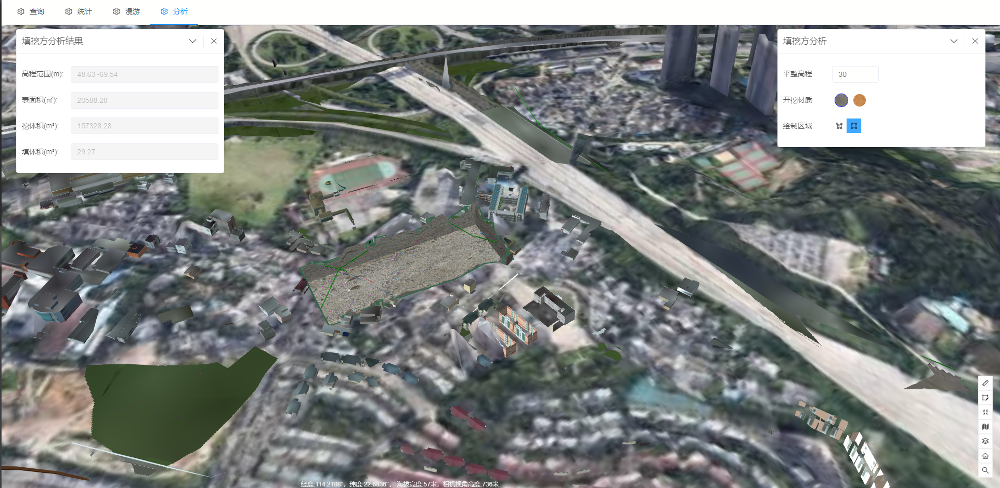

# 开挖分析

> municipal-cutFill 填挖方分析组件，用于分析在一定地图范围内，开挖一定高程或者填充一定高程所需的土方量或者要挖开的土方量

## 效果一览




## 基本用法

> 基本的填挖方分析组件用法，用户可通过drawTextures自定义开挖的材质，填挖方组件内需嵌套cutfillresult组件用于展示结果

```vue
<template>
  <municipal-cutfill :drawTextures="drawTextures">
    <municipal-cutfillresult :panelStyle="resultStyle"></municipal-cutfillresult>
  </municipal-cutfill>
</template>

<script>
export default {
  name: "CutFillAna",
  data() {
    return {
      drawTextures: [
        '/static/cesium/model/wall.jpg',
        '/static/cesium/model/wall1.jpg'
      ],
    resultStyle: {
      width: '400px',
        position: 'absolute',
        left: '2em',
        top: '4em'
    }
    };
  }
};
</script>
```

## 属性

### 属性说明

属性|说明|取值类型|默认值
--|:--:|:--:|:--:
vueKey|municipal-web-scene组件的 ID，当使用多个mapgis-web-scene组件时，需要指定该值，来唯一标识mapgis-web-scene组件|String|default vueIndex|当
vueIndex|municipal-web-scene 插槽中使用了多个相同组件时，例如多个 municipal-igs-doc-layer 组件，用来区分组件的标识符|Number|空
drawTextures|设置填挖方分析的纹理|Array|[]
[panelProps](https://aalldd.github.io/vue-cesium-component/components/common/panel.html#属性)|见面板工具属性说明|Attr|见面板工具说明


## 事件

### `@load`

- **描述:** 在 开挖分析组件 加载完毕后发送该事件
- **回调参数** `{ vm }`
- `vm` dynacut vue实例对象

### `@unload`

- **描述:** 在 dynacut 注销完毕后发送该事件
- **回调参数** `{ vm }`
- `vm` dynacut vue实例对象


