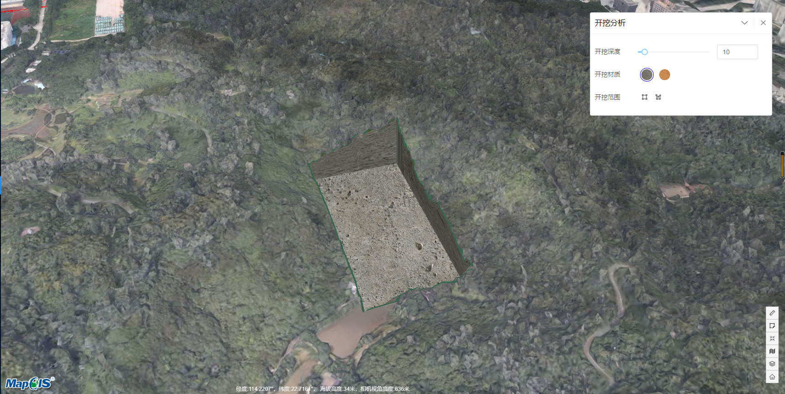

# 开挖分析

> municipal-dynacut 开挖分析组件，提供了基于三维绘制工具，进行地形开挖的功能，并计算挖掘的相关数据

##效果一览




## 基本用法

> 基本的开挖分析组件用法，开挖分析组件需嵌套在m3d图层内，不传参就全使用默认值 其中draggable,title,closeable,expandable这四个属性用来控制开挖分析的面板是否可拖动，名称，可关闭，可展开

```vue

<template>
  <municipal-commonLayer>
    <municipal-dynacut title="开挖分析"
                       :draggable="true"
                       :closeable="true"
                       :expandable="true"
                       :panel-style="{width:'400px'}"
                       panel-class="dynacut"
    ></municipal-dynacut>
  </municipal-commonLayer>
</template>

<style scoped>
.dynacut {
  /*  此处可对开挖分析面板自定义样式*/
  background: #1e6ceb;
}
</style>
```

## 自定义开挖分析的绘制纹理,开挖形状，需要挖掘的图层

> drawTextures:用户自己提供开挖分析的绘制问题的图片路径，根据图片的不同，挖掘的效果也不同
> drawTools:用户指定需要哪些开挖的形状，目前支持矩形，多边形，圆形的开挖形状
> layerIndexs:用户自定哪些图层需要被挖开

```html
<template>
  <municipal-commonLayer>
    <municipal-dynacut
      title="开挖分析"
      :drawTools="['square', 'polygon']"
      :drawTextures="drawTextures"
      :layerIndexs="[0,1]">
    </municipal-dynacut>
  </municipal-commonLayer>
</template>
<script>
  export default {
    name: "dynacutAna",
    data(){
      return {
        drawTextures: [
          '/static/cesium/model/wall.jpg',
          '/static/cesium/model/wall1.jpg'
        ]
      }
    }
  };
</script>
```

## 开挖结束之后获取开挖数据

> 1.监听开挖分析组件的onDynacut事件可以获取开挖结束之后的数据</br>
> 2.数据项包括 dynacut开挖分析对象实例 fArea挖掘掉的土方量
> sArea挖掘的面积 positions开挖的坐标点 heightRange开挖的地形高程范围
> digDistance挖掘的深度

```html
<template>
  <municipal-commonLayer>
    <municipal-dynacut
      title="开挖分析"
      @onDynacut="getDynacutInfo">
    </municipal-dynacut>
  </municipal-commonLayer>
</template>
<script>
  export default {
    name: "dynacutAna",
    methods:{
      getDynacutInfo(payload){
        console.log(payload)
      }
    }
  };
</script>
```

## 属性

### 属性说明

属性|说明|取值类型|默认值
--|:--:|:--:|:--:
vueKey|municipal-web-scene组件的 ID，当使用多个mapgis-web-scene组件时，需要指定该值，来唯一标识mapgis-web-scene组件|String|default vueIndex|当
vueIndex|municipal-web-scene 插槽中使用了多个相同组件时，例如多个 municipal-igs-doc-layer 组件，用来区分组件的标识符|Number|空
drawTextures|设置开挖分析的纹理|Array|[]
drawTools|设置开挖分析的绘制方式|Array|["square", "polygon", "circle"]
layerIndexs|设置开挖分析需要挖掘的图层index|Array|[0,1]
[panelProps](https://aalldd.github.io/vue-cesium-component/components/common/panel.html#属性)|见面板工具属性说明|Attr|见面板工具说明


## 事件

### `@load`

- **描述:** 在 开挖分析组件 加载完毕后发送该事件
- **回调参数** `{ vm }`
- `vm` dynacut vue实例对象

### `@unload`

- **描述:** 在 dynacut 注销完毕后发送该事件
- **回调参数** `{ vm }`
- `vm` dynacut vue实例对象

### `@onDynacut`

- **描述:** 在 开挖分析结束后发送该事件
- **回调参数** `{ onDynacut }`
- `onDynacut`
  返回的数据包括:
  dynacut开挖分析对象实例 </br>fArea挖掘掉的土方量</br>
  sArea挖掘的面积</br> positions开挖的坐标点</br> heightRange开挖的地形高程范围</br>
  digDistance挖掘的深度


