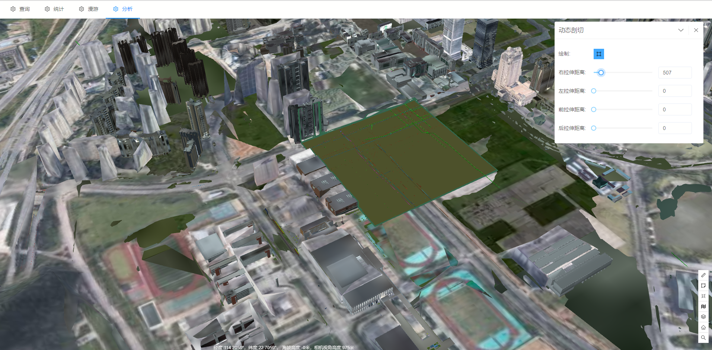

# 开挖分析

> municipal-dynamicCut 动态剖切组件，用户可以自由控制剖切的地面图层范围

## 效果一览




## 基本用法

> 基本的动态剖切组件用法

```vue
<template>
  <municipal-section></municipal-section>
</template>

<script>
export default {
  name: "SectionAna"
};
</script>
```

## 属性

### 属性说明

属性|说明|取值类型|默认值
--|:--:|:--:|:--:
vueKey|municipal-web-scene组件的 ID，当使用多个mapgis-web-scene组件时，需要指定该值，来唯一标识mapgis-web-scene组件|String|default vueIndex|当
vueIndex|municipal-web-scene 插槽中使用了多个相同组件时，例如多个 municipal-igs-doc-layer 组件，用来区分组件的标识符|Number|空
[panelProps](https://aalldd.github.io/vue-cesium-component/components/common/panel.html#属性)|见面板工具属性说明|Attr|见面板工具说明


## 事件

### `@load`

- **描述:** 在 开挖分析组件 加载完毕后发送该事件
- **回调参数** `{ vm }`
- `vm` dynacut vue实例对象

### `@unload`

- **描述:** 在 dynacut 注销完毕后发送该事件
- **回调参数** `{ vm }`
- `vm` dynacut vue实例对象


