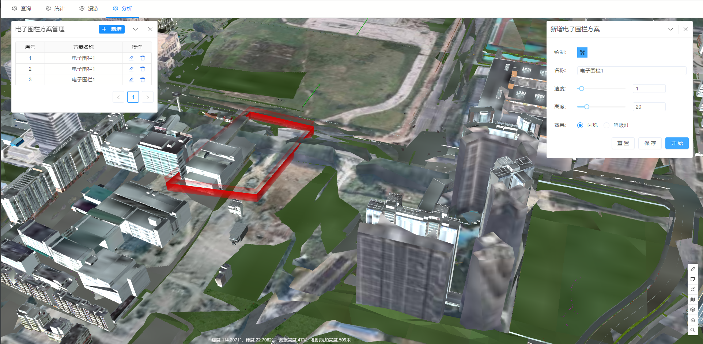

# 电子围栏

> municipal-fence 电子围栏组件，用来模拟围墙效果

## 效果一览




## 基本用法

> 基本的电子围栏组件用法需配合plan-mananger公共组件使用，实现电子围栏方案管理，用户需指定当前是修改，还是预览，还是添加电子围栏状态

> 用户可以自定义需要的电子围栏参数

> 用户通过savePlan回调，获取所需数据，然后保存至方案中

```vue
<template>
  <div>
    <municipal-fence :title="title" v-if="fenceVisible" :status="status" :initFormData="fenceData"
                     @savePlan="savePlan"></municipal-fence>
    <municipal-plan-mananger v-if="planVisible" :title="titlePlan" @close="planVisible=false"
                             :dataSource="planData"
                             @addPlan="addPlan"
                             @onRowClick="previewPlan"
                             @modifyPlan="modifyPlan"
                             @deletePlan="deletePlan"
                             :loading="loading">
    </municipal-plan-mananger>
  </div>
</template>

<script>
import Store from "@/store/store";

export default {
  name: "FenceAna",
  data() {
    return {
      title: '新增电子围栏方案',
      titlePlan: '电子围栏方案管理',
      planVisible: true,
      fenceVisible: false,
      loading: false,
      //全部的电子围栏方案数据，从服务获取
      planData: [],
      status: 'add',
      //当前需要去编辑的电子围栏数据，是单条的数据，但是需要整理为Array<{uniKey,title,value}>的数据形式
      fenceData:[{ uniKey: 'planName', title: '名称', value: '电子围栏1' }, { uniKey: 'speed', title: '速度', value: '1'
      }, {
        uniKey: 'maxHeight',
        title: '高度',
        value: '20'
      }, {
        uniKey: 'wallType',
        title: '效果',
        value: '0'
      }
      ]
    };
  },
  mounted() {
    this.store = new Store();
    this.getFenceData();
  },
  methods: {
    addPlan() {
      this.fenceVisible = true;
      this.status = 'add';
      this.title = '新增电子围栏方案';
    },
    previewPlan(record) {
      this.formatData(record);
      this.fenceVisible = true;
      this.status = 'preview';
      this.title = '预览电子围栏方案';
    },
    formatData(record) {
      let result = [];
      for (let key in record) {
        let value = record[key];
        result.push({
          uniKey: key,
          value: value
        });
      }
      this.fenceData = result;
    },
    modifyPlan(record) {
      this.formatData(record);
      this.fenceVisible = true;
      this.isPreview = true;
      this.status = 'modify';
      this.title = '修改电子围栏方案';
    },
    async deletePlan(record) {
      const data = await this.store.deleteFenceData({
        ID: record.ID
      });
      if (data.statusCode == '0000') {
        this.$message.success('删除成功！');
        await this.getFenceData();
        this.planVisible = false;
      } else {
        this.$message.error("删除失败！");
      }
    },
    async getFenceData() {
      const fenceData = await this.store.getFenceData();
      let result = [];
      if (fenceData && fenceData.success) {
        if (fenceData.data?.length > 0) {
          fenceData.data.forEach((item, index) => {
            result.push({
              ...item,
              key: index + 1
            });
          });
        }
      }
      this.planData = result;
    },
    savePlan(data, status) {
      const pointArr = data.pointArr;
      const minimumHeights = data.minimumHeights;
      data.pointArr = "'" + pointArr + "'";
      data.minimumHeights = "'" + minimumHeights + "'";
      //新增电子围栏数据
      const modifyData = async (type, ID) => {
        let param;
        type === '保存' ? param = {
          type: 'add',
          ...data
        } : param = {
          ID,
          ...data
        };
        const res = await this.store.addFenceData(param);
        if (res.success) {
          this.$message.success(`${type}成功`);
          this.getFenceData();
        } else {
          this.$message.error(`${type}失败`);
        }
      };
      //如果有状态，就用状态去判断
      if (status) {
        if (status === 'add') {
          modifyData('保存');
        } else {
          modifyData('修改', data.ID);
        }
      } else {
        // 没有状态，就用id去判断
        if (!data.ID) {
          modifyData('保存');
        } else {
          modifyData('修改', data.ID);
        }
      }
    }
  }
};
</script>
```

## 属性

### 属性说明

属性|说明|取值类型|默认值
--|:--:|:--:|:--:
vueKey|municipal-web-scene组件的 ID，当使用多个mapgis-web-scene组件时，需要指定该值，来唯一标识mapgis-web-scene组件|String|default vueIndex|当
vueIndex|municipal-web-scene 插槽中使用了多个相同组件时，例如多个 municipal-igs-doc-layer 组件，用来区分组件的标识符|Number|空
initFormData|用于指定要渲染的围栏参数|Array|见示例
status|状态，指定是新增，预览，修改|String|'add'(取值add modify preview)
[panelProps](https://aalldd.github.io/vue-cesium-component/components/common/panel.html#属性)|见面板工具属性说明|Attr|见面板工具说明


## 事件

### `@load`

- **描述:** 在 开挖分析组件 加载完毕后发送该事件
- **回调参数** `{ vm }`
- `vm` dynacut vue实例对象

### `@unload`

- **描述:** 在 dynacut 注销完毕后发送该事件
- **回调参数** `{ vm }`
- `vm` dynacut vue实例对象

### `@savePlan`

- **描述:** 点击保存按钮之后的回调
- **回调参数** `{ data, status }`
- `vm` data 所有的电子围栏参数  status当前是新增还是修改电子围栏

