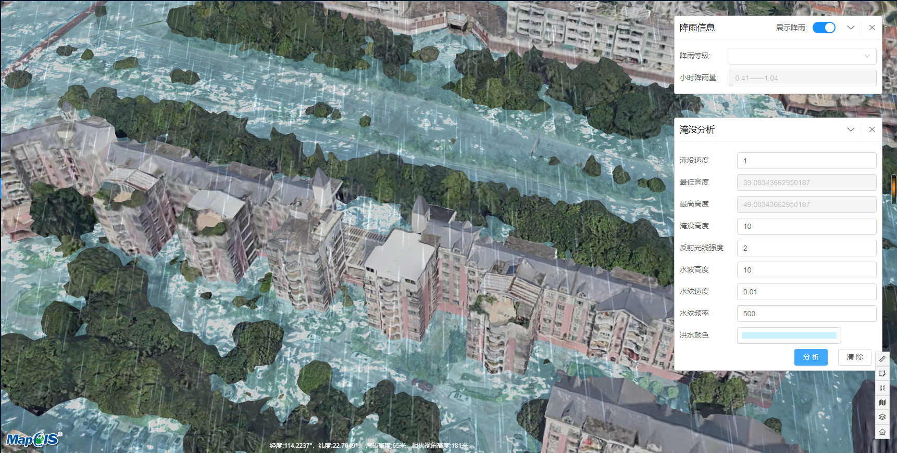

# 淹没分析

> municipal-flood 淹没分析组件，提供了根据地形的淹没效果，降雨效果

## 效果一览



## 基本用法

> 基本的淹没分析组件用法,一般配合municipal-rain组件一起使用,可以模拟降雨然后进行水淹效果分析

```vue
<template>
  <municipal-flood>
    <municipal-rain title="降雨信息" :rain-level="rainLevel"></municipal-rain>
  </municipal-flood>
</template>

<script>
export default {
  name: "FloodAna",
  data() {
    return {
      rainLevel: [{rain: '小雨', level: '0——0.41', rainSpeed: 4},
        {rain: '中雨', level: '0.41——1.04', rainSpeed: 8},
        {rain: '大雨', level: '1.04——2.08', rainSpeed: 12},
        {rain: '暴雨', level: '2.08——4.17', rainSpeed: 20},
        {rain: '大暴雨', level: '4.17——10.41', rainSpeed: 30},
        {rain: '特大暴雨', level: '10.41——以上', rainSpeed: 50}]
    };
  }
};
</script>

<style scoped>

</style>

```

## 控制初始淹没参数以及控制淹没参数选项 重要

用户可以使用对象的形式，指定每个淹没参数的名称，是否显示，每个淹没参数对应的初始值
:::warning
需要注意的是，参数中的uniqueKey不要去改，一旦改变，会出现错误
:::

```html

<template>
  <municipal-commonLayer>
    <municipal-flood :components="components"></municipal-flood>
  </municipal-commonLayer>
</template>

<script>

  export default {
    data() {
      return {
        components: [{itemName: '淹没速度', itemValue: 1, uniqueKey: 'speed'},
          {
            itemName: '最低高度',
            itemValue: 0,
            uniqueKey: 'startHeight'
          }, {
            itemName: '最高高度',
            itemValue: 0,
            uniqueKey: 'maxHeight'
          }, {
            itemName: '淹没高度',
            itemValue: 10,
            uniqueKey: 'floodHeight'
          }, {
            itemName: '反射光线强度',
            itemValue: 2,
            uniqueKey: 'specularIntensity'
          }, {
            itemName: '水波高度',
            itemValue: 10,
            uniqueKey: 'amplitude'
          }, {
            itemName: '水纹速度',
            itemValue: 0.01,
            uniqueKey: 'animationSpeed'
          }, {
            itemName: '水纹频率',
            itemValue: 500,
            uniqueKey: 'frequency'
          }, {
            itemName: '洪水颜色',
            itemValue: 'rgba(149,232,249,0.5)',
            uniqueKey: 'floodColor'
          }]
      }
    }
  }
</script>
```

## 是否需要开启地形模式：

> 淹没分析可开启地形，模式，地形模式一旦开启，用户将无法自己修改最小淹没高度，最大淹没高度

> 最小淹没高度将由系统自己计算出当前范围内，地面最低高度生成，最大淹没高度将由用户指定的淹没高度加上最小淹没高度配合地形最大高度生成

> 即用户指定的最大高度>地形最高高度时，最大淹没高度=地形最高高度

> 用户指定的最大高度<地形最高高度时，最大淹没高度=用户指定的最大高度


```html

<template>
  <municipal-commonLayer>
    <municipal-flood :terrainMode="true"></municipal-flood>
  </municipal-commonLayer>
</template>
<script>
```

## 属性

### 属性说明

属性|说明|取值类型|默认值
--|:--:|:--:|:--:
vueKey|municipal-web-scene组件的 ID，当使用多个mapgis-web-scene组件时，需要指定该值，来唯一标识mapgis-web-scene组件|String|default vueIndex|当
vueIndex|municipal-web-scene 插槽中使用了多个相同组件时，例如多个 municipal-igs-doc-layer 组件，用来区分组件的标识符|Number|空
components|设置淹没分析的参数名称，每个参数对应的初始值字段名需和示例保持一致，且uniqueKey不要更改|Array|见示例《控制初始淹没参数以及控制淹没参数选项》
needRain|是否需要降雨效果|Boolean|true
[panelProps](https://aalldd.github.io/vue-cesium-component/components/common/panel.html#属性)|见面板工具属性说明|Attr|见面板工具说明
terrainMode|是否开启地形模式:具体用法见示例|Boolean|true

## 事件

### `@load`

- **描述:** 在 淹没分析组件 加载完毕后发送该事件
- **回调参数** `{ vm }`
- `vm` flood vue实例对象

### `@unload`

- **描述:** 在 flood 注销完毕后发送该事件

### `@onClose`

- **描述:** 在 淹没分析面板关闭后发送该事件
- **回调参数** `{ vm }`
- `vm` flood vue实例对象


