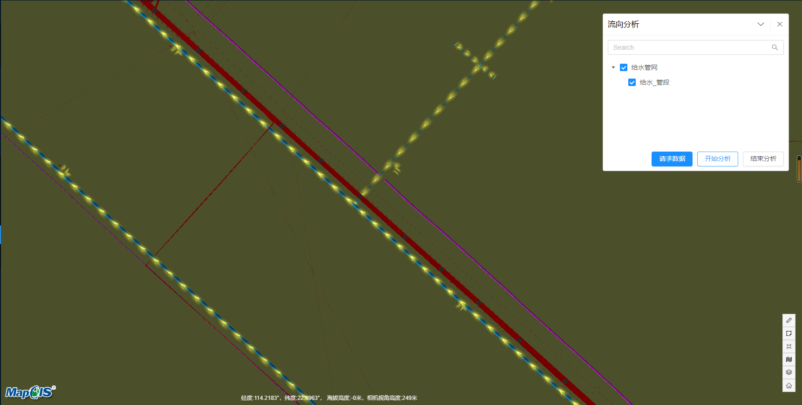

# 流向分析

> municipal-flow 流向分析组件，根据用户传入的管道信息，渲染出所选图层中的滚动箭头流向效果

## 效果一览



## 基本用法

> 由于流向分析组件依赖了基本库中的组件Layer,所以流向分析需要展示的图层，可以有两种方式进行展示
> 1.使用筛选规则，从commonConfig中传入的全部图层数据中进行筛选
> 2.自己传入图层树数据
> 3.是否需要组件帮您将流向分析数据缓存起来，由于流向分析需要一个地图中所有的管段数据，数据量会非常大，建议缓存
> 4.我们的组件库不负责进行收发请求，需要用户在外面自己通过服务获取流向数据，但是我们会将请求参数所需数据提供出来

## 参数解析
> 1.layerGroup:筛选图层树的规则,同时包括了每个图层对应的流向分析纹理的图片，数据结构:</br>
> {'给水管网': { subLayers: ['给水_管段'], url: '/static/cesium/Assets/Images/arrow.png' } }</br>
> 2.flowData:流向分析数据,组件通过该数据完成流向的展示，数据结构:</br>
> Array （typeFlow）
//typeFlow :{
 features:Array:attributes,geometry 流向分析的数据体，里面需要有attributes用于记录查询到的每个字段对应数据的信息，比如{'流向':1,'管径‘:1000},gemetry用于记录管段的坐标信息，类型是数组,
 fieldAliases:Array:attrName features中对应的attributes中的字段顺序,这样我才能精准的拿到诸如流向，管径，管长，终点地面高程，起点地面高程的数据
 layerId:Number 该图层在二维服务中的id
 layerName:String  该图层的名称
}</br>
> 3.cacheData 是否需要浏览器缓存流向数据，如果为true,流向分析会优先从浏览器缓存中获取流向数据进行渲染</br>
> 4.heightMapRepeat  视角高度与管道上箭头数量，箭头宽度的关系，用于抽晰,默认值与示例中的一致</br>


```vue
<template>
  <municipal-flow @query="query"
                  :layerGroup="layerGroup"
                  :flowData="flowData"
                  :cacheData="cacheData"
                  :heightMapRepeat="heightMapRepeat"
                  @load="onLoad">
  </municipal-flow>
</template>

<script>
//这里封装了请求的方法
import Store from '@/store/store';

export default {
  name: "FlowAna",
  data() {
    return {
      //流向管网信息
      layerGroup: {
        '给水管网': {
          subLayers: ['给水_管段'],
          url: '/static/cesium/Assets/Images/arrow.png'
        }
      },
      //流向数据信息
      flowData: [],
      //是否需要浏览器缓存流向数据信息
      cacheData: true,
      //需要的流向分析字段
      outFields: '流向,起点地面高程,终点地面高程,管长,管径',
      heightMapRepeat:{
        type: Object,
        default: () => {
          return {
            level0: {
              height: 70,
              repeatRate: 1.5,
              arrowWidth: 30
            },
            level1: {
              height: 100,
              repeatRate: 1,
              arrowWidth: 30
            },
            level2: {
              height: 300,
              repeatRate: 0.7,
              arrowWidth: 20
            },
            level3: {
              height: 500,
              repeatRate: 0.5,
              arrowWidth: 15
            },
            level4: {
              height: 800,
              repeatRate: 0.2,
              arrowWidth: 10
            },
            level5: {
              height: 1200,
              repeatRate: 0.1,
              arrowWidth: 5
            }
          };
        }
      }
    };
  },
  methods: {
    async query(params) {
      // 请求参数会将所选图层的layerId,地图服务名称返回供服务查询
      const store = new Store();
      const data = await store.queryFlow(params.mapServerName, params.layerIds, {outFields: this.outFields});
      this.flowData = data.map(item => item.data);
    },
    onLoad(payload) {
      this.flowVm = payload;
    }
  }
};
</script>
```

## 属性

### 属性说明

属性|说明|取值类型|默认值
--|:--:|:--:|:--:
vueKey|municipal-web-scene组件的 ID，当使用多个municipal-web-scene组件时，需要指定该值，来唯一标识mapgis-web-scene组件|String|default vueIndex|当
vueIndex|municipal-web-scene 插槽中使用了多个相同组件时，例如多个 municipal-igs-doc-layer 组件，用来区分组件的标识符|Number|空
[panelProps](https://aalldd.github.io/vue-cesium-component/components/common/panel.html#属性)|见面板工具属性说明|Attr|见面板工具说明
layerData|生成的树的数据,每条数据中需包含title,children字段,指定了customTreeData为false的话，不要指定该属性|Array|空
customTreeData|layer组件是否自定义树的数据|Boolean|false
layerGroup|layer组件筛选树节点的规则，具体数据结构见示例|Object|空
heightMapRepeat|视角高度与管道上箭头数量，箭头宽度的关系，用于抽晰,默认值与示例中的一致|Object|见示例
cacheData|是否需要浏览器缓存流向数据，如果为true,流向分析会优先从浏览器缓存中获取流向数据进行渲染|Boolean|true
flowData|流向分析数据,组件通过该数据完成流向的展示|Array|默认值见示例
uiControlled|是否需要自定义流向分析面板|Boolean|否


## 事件

### `@load`

- **描述:** 在 隧道分析组件 加载完毕后发送该事件
- **回调参数** `{ vm }`
- `vm` flow vue实例对象

### `@unload`

- **描述:** 在 flow 注销完毕后发送该事件

### `@onClose`

- **描述:** 在 流向分析面板关闭后发送该事件

### `@query`

- **描述:** 获取流向分析服务请求参数的回调
- **回调参数** `{ params }`
- `params` 流向的请求参数，包括mapServerName,服务名称（从commonConfig中获取）,layerIds(勾选的图层的layerId)

