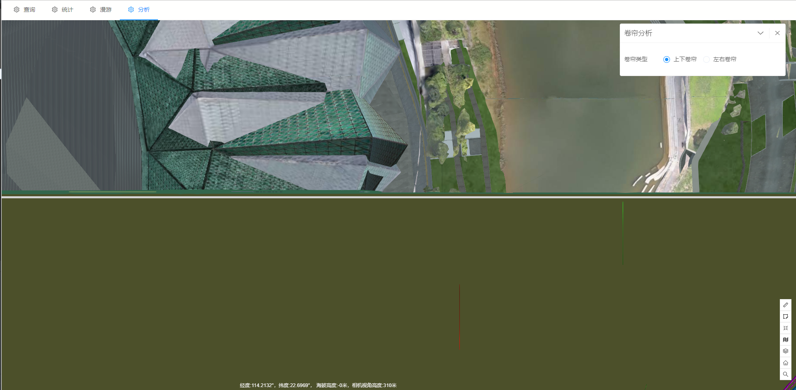

# 卷帘分析

> municipal-rolling 卷帘分析组件，用于将地上模型通过拉窗帘的方式，卷开，可以更加直观的看到管线与地上模型的对应关系

## 效果一览




## 基本用法

> 基本的卷帘分析用法,用户可以去自己指定卷帘线与地形的偏移值

```vue
<template>
  <municipal-roll :offset="offset">
  </municipal-roll>
</template>

<script>
export default {
  name: "RollingAna",
  data() {
    return {
      offset: [0, 0]
    };
  }
};
</script>
```

## 属性

### 属性说明

属性|说明|取值类型|默认值
--|:--:|:--:|:--:
vueKey|municipal-web-scene组件的 ID，当使用多个mapgis-web-scene组件时，需要指定该值，来唯一标识mapgis-web-scene组件|String|default vueIndex|当
vueIndex|municipal-web-scene 插槽中使用了多个相同组件时，例如多个 municipal-igs-doc-layer 组件，用来区分组件的标识符|Number|空
offset|卷帘线与地图的偏移值|Array|[]
[panelProps](https://aalldd.github.io/vue-cesium-component/components/common/panel.html#属性)|见面板工具属性说明|Attr|见面板工具说明


## 事件

### `@load`

- **描述:** 在 卷帘分析组件 加载完毕后发送该事件
- **回调参数** `{ vm }`
- `vm` rolling vue实例对象

### `@unload`

- **描述:** 在 卷帘分析组件 注销完毕后发送该事件
- **回调参数** `{ vm }`
- `vm` rolling vue实例对象


