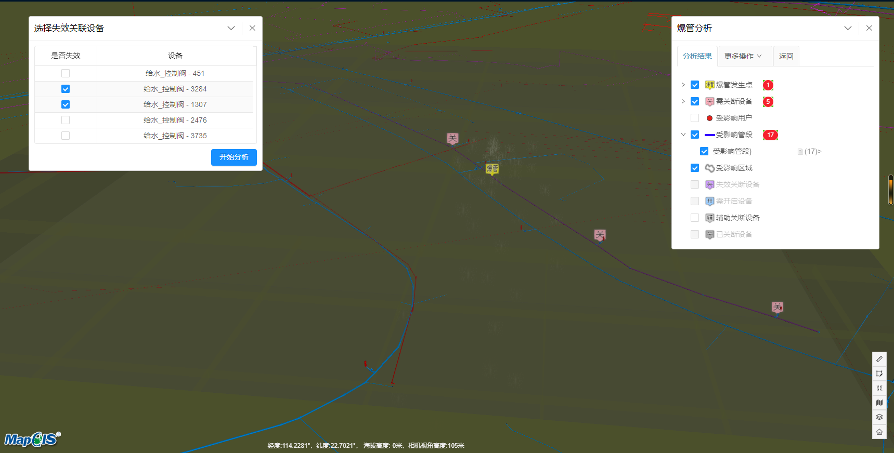
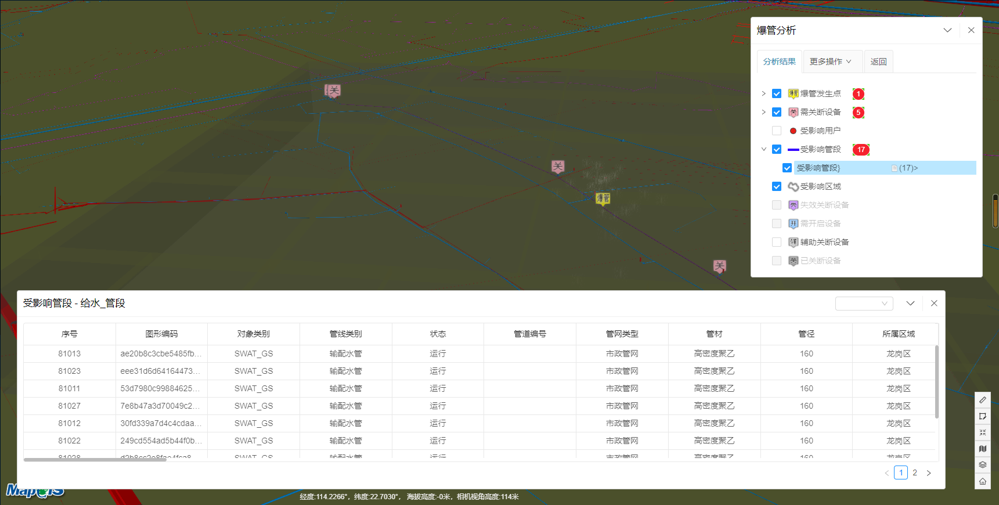

# 爆管分析

> municipal-squib 爆管分析组件,用户点击某个水管或者燃气管，界面展示管段爆炸之后水花喷溅的效果，并展示所有的受影响管段，受影响用户，爆管发生点，受影响区域，需关断设备等

## 效果一览





## 服务接口示例
> 爆管分析需要做如下准备</br>
> 1.需要部署cityInterFace的相关服务，爆管分析的服务涉及到了GPServer，AuxDataServer，MapServer
> 2.需要准备相关静态文件，并作为一个map表传给爆管分析组件
> 3.需要了解后端传来的字段，并将服务传来的数据整理成规范的格式，相关字段规范见后续的字段规范章节

服务接口实现 store.js
service是使用axios封装的一个请求类，用户可以基于自己的服务ip自行封装
```javascript
import Service from '@/service/service';
class Store{
  constructor() {
    this.IntegratedServer = Service.City.Plugin("IntegratedServer");
    this.GPServer = Service.City.Plugin("GPServer");
    this.ScadaServer = Service.City.Plugin('ScadaServer');
    this.MapServer = Service.City.Plugin('MapServer');
    this.AuxDataServer = Service.City.Plugin("AuxDataServer");
  }
  //查询爆管信息
//funcName : 供水：IncidentOperNew，燃气：MidPressOperEx
  async IncidentOperNew(mapServiceName, funcName, params) {
    try {
      const {data} = await this.GPServer.get(`/${mapServiceName}/${funcName}`, {params});
      return data;
    } catch (error) {
      return [];
    }
  }

  查询用户信息
  async GetRelationshipList(mapServiceName) {
    try {
      const {data} = await this.AuxDataServer.get(`/${mapServiceName}/GetRelationshipList`);
      return data;
    } catch (error) {
      return [];
    }
  }

//查询设备oid信息
  async QueryObjectIds(mapServiceName, layerId, params) {
    try {
      //QueryByObjectIds
      const {data} = await this.AuxDataServer.post(`/${mapServiceName}/${layerId}/QueryObjectIds`, params);
      return data;
    } catch (error) {
      return [];
    }
  }

//查询设备详细信息
  async query(mapServiceName, layerId, params) {
    try {
      const {data} = await this.MapServer.post(`/${mapServiceName}/${layerId}/query`, params);
      return data;
    } catch (error) {
      return [];
    }
  }
}
```

## 基本用法
> 基本的爆管分析用法，</br>query用来查询爆管点相关信息，queryFeature用来获取管网的具体信息，我们根据这个数据来渲染三维效果，
> </br>queryInvalid用来查询失效设备，queryDetail用于获取设备详情信息，SQUIB_ICONS用来渲染地图中的图标，
> </br>featuresData是queryFeatures返回的数据，detailData是queryDetail返回的数据，squibData是querySquibPoint返回的数据
> ,invalidData是queryInvalid返回的数据

```vue
<template>
  <municipal-squib @query="querySquibPoint"
                   @queryFeatures="queryFeatures"
                   @queryInvalid="queryInvalid"
                   @queryDetail="queryDetail"
                   :squibData="squibData"
                   :invalidData="invalidData"
                   :SQUIB_ICONS="SQUIB_ICONS"
                   :featureData="featuresData"
                   :detailData="detailData"
                   :loading="loading"></municipal-squib>
</template>

<script>
import Store from '@/store/store';

export default {
  name: "SquibAna",
  data() {
    return {
      //爆管信息
      squibData: [],
      SQUIB_ICONS: {
        fireImg: "/static/cesium/model/fire.png",
        fountainImg: "/static/cesium/model/fountain.png",
        list: "/static/images/analysisimgs/list.png",
        highlight: "/static/images/squib/高亮.png",
        civFeatureMetaTypeIncidentPoint: "/static/images/squib/爆管点.png", //爆管发生点
        civFeatureMetaTypeSwitch: "/static/images/squib/需关闭阀门.png", //需关断设备
        civFeatureMetaTypeClosedSwitch: "/static/images/squib/需关已关阀门.png", //已关断设备
        civFeatureMetaTypeShouldOpenSwitch: "/static/images/squib/需开启阀门.png", //需开启设备
        civFeatureMetaTypeInvalidateSwitch: "/static/images/squib/失效关断设备.png", //失效关断设备
        civFeatureMetaTypeSwieffect: "/static/images/squib/停水用户.png", //受影响用户
        civFeatureMetaTypePipeLine: "/static/images/squib/停水管线.png", //受影响管段
        civFeatureMetaTypeAssistSwitch: "/static/images/squib/辅助关闭阀门.png", //辅助关断设备
        civFeatureMetaTypeRegionResult: "/static/images/squib/受影响区域.png", //受影响区域
        civFeatureMetaTypeResstop: "/static/images/squib/资源装卸点.png", //资源装卸点
        civFeatureMetaTypeRescenter: "/static/images/squib/资源中心.png" //受影响水源
      },
      //设备信息
      featuresData: [],
      //失效设备
      invalidData: [],
      //设备详细信息
      detailData: {},
      loading: false,
      SQUIB_RESULT_TYPES:{
        SQUIBPOINT: "civFeatureMetaTypeIncidentPoint", //爆管发生点
        SHOULDCLOSEDSWITCH: "civFeatureMetaTypeSwitch", //需关断设备
        CLOSEDSWITCH: "civFeatureMetaTypeClosedSwitch", //已关断设备
        SHOULDOPENSWITCH: "civFeatureMetaTypeShouldOpenSwitch", //需开启设备
        INVALIDATESWITCH: "civFeatureMetaTypeInvalidateSwitch", //失效关断设备
        ASSISTSWITCH: "civFeatureMetaTypeAssistSwitch", //辅助关断设备
        EFFECTEDUSER: "civFeatureMetaTypeSwieffect", //受影响用户
        EFFECTEDPIPELINE: "civFeatureMetaTypePipeLine", //受影响管段
        EFFECTEDREGION: "civFeatureMetaTypeRegionResult", //受影响区域
        EFFECTEDRECENTER: "civFeatureMetaTypeRescenter", //受影响水源
        RESSTOP: "civFeatureMetaTypeResstop" //资源装卸点
      },
      DEFUALT_SELECTED_TYPES:[ //默认显示的类型
        "civFeatureMetaTypeIncidentPoint",
        "civFeatureMetaTypeSwitch",
        "civFeatureMetaTypeSwieffect",
        "civFeatureMetaTypePipeLine",
        "civFeatureMetaTypeRegionResult"
      ],
      EXLUDE_TYPES:[ //排除在外的类型
        "civFeatureMetaTypeRescenter",
        "civFeatureMetaTypeResstop"
      ]
    };
  },
  mounted() {
    this.store = new Store();
  },
  methods: {
    async querySquibPoint(params) {
      const funcName = 'IncidentOperNew';
      const {mapServerName, ...rest} = params;
      this.loading = true;
      this.mapServerName = mapServerName;
      const res = await this.store.IncidentOperNew(mapServerName, funcName, rest);//获取爆管点的所有分析结果
      this.squibData = res;
      this.loading = false;
    },
    async queryFeatures(params) {
      const promises = [];
      params.forEach(layerItems => {
        layerItems.forEach(item => {
          const {layerId, objectIds, cacheBust, mapServerName, type} = item;
          const promise = this.store.query(mapServerName, layerId, {objectIds, cacheBust});
          promises.push({promise, type});
        });
      });
      //注意这里要将type回传，要不然组件无法知道哪个三维效果对应哪种管段
      const data = await Promise.all(promises.map(item => item.promise));
      this.featuresData = data.map((item, index) => {
        return {
          type: promises[index].type,
          data: item
        };
      });
    },
    async queryInvalid(params) {
      const promises = params.map(param => {
        const {layerId, mapServerName, layerItem, ...rest} = param;
        return this.store.query(mapServerName, layerId, rest);
      });
      const dataS = await Promise.all(promises);
      //回传的时候需要将layerItem回传回来
      this.invalidData = dataS.map((data, index) => {
        return {
          data: data,
          layerItem: params[index].layerItem
        };
      });
    },
    async queryDetail(params) {
      const {mapServerName, layerId, ...rest} = params;
      const data = await this.store.query(mapServerName, layerId, rest);
      this.detailData = data;
    }
  }
};
</script>
```
## 属性

### `squibData`

- **类型:** `Array`
- **侦听属性**
- **默认值:** `[]`
- **描述:** 爆管分析数据，数据从接口IncidentOperNew获取
- **数据格式** 标准的爆管分析查询接口数据格式，见数据接口规范章节

### `invalidData`
- **类型:** `Array`
- **侦听属性**
- **默认值:** `[]`
- **描述:** 失效关阀数据，数据从接口query获取,通过组件的@queryInvalid获取请求参数,点击扩大关阀时，会调用该接口
- **数据格式** 标准的设备查询接口数据格式,见数据接口规范章节

### `featuresData`
- **类型:** `Array`
- **侦听属性**
- **默认值:** `[]`
- **描述:** 所有爆管设备的管网信息，数据从接口query中获取，通过组件的queryFeatures获取请求参数，为了使组件能够了解到是哪一种管段的数据，需要将参数中传过来的type数据回传
- **数据格式** 标准的管网数据格式,见管网数据接口规范章节

### `detailData`
- **类型:** `Object`
- **侦听属性**
- **默认值:** `[]`
- **描述:** 点击设备详情按钮之后获取到的设备详细信息，数据从接口query中获取，通过组件的queryDetail获取请求参数
- **数据格式** 标准的管网数据格式,见管网数据接口规范章节

### `SQUIB_ICONS`
- **类型:** `Object`
- **侦听属性**
- **默认值:** `{}`
- **描述:** 每种爆管数据类型对应的图标url
- **数据格式** 见示例

### `SQUIB_RESULT_TYPES`
- **类型:** `Array`
- **侦听属性**
- **默认值:** `[]`
- **描述:** 每种爆管数据类型名称对照，其中示例中的key值不可变更，需要与服务中的civFeatureMetaType字段相对应
- **数据格式** 见示例

### `EXLUDE_TYPES`
- **类型:** `Array`
- **侦听属性**
- **默认值:** `[]`
- **描述:** 排除在外的类型
- **数据格式** 见示例

### `DEFUALT_SELECTED_TYPES`
- **类型:** `Array`
- **侦听属性**
- **默认值:** `[]`
- **描述:** 默认选中的类型
- **数据格式** 见示例

### `panelOptions`
- **类型:** `set`
- **侦听属性**
- **默认值:**
- **描述:** 控制爆管分析面板的展示相关数据
- **数据格式** 见panel章节


## 数据示例

爆管数据示例
```javascript
[{
  civFeatureMetaType: "civFeatureMetaTypeIncidentPoint",
  civFeatureMetaTypeName: "爆管发生点",
  region: null,
  resultList:[{
    layerId: 1, layerName: "给水_管段", objectIds: [1601], relationships: []
  }]
}]
```

管网设备数据示例,fieldAliases用来记录字段，features中为管网的详细数据
```javascript
[{
  displayFieldName: "OID",
  features:[{
    attributes:{OID: 2730, ElemID: 1092, 序号: 9354,...rest},
    geometry: {x: 130669.773, y: 37344.748, spatialReference: {wkid: 4526}},
    symbol: null
  }],
  fieldAliases:{ENABLED: "ENABLED",
  ElemID: "ElemID",
  GUID: "GUID",
  OID: "OID",
  mpLayer: "layer",...rest},
  geometryType: "civGeometryPoint",
  hasM: false,
  hasMediaFile: true,
  hasZ: false,
  layerId: 6,
  layerName: "给水_控制阀",
  relationships: []
}]
```

## 事件

### `@load`

- **描述:** 在 隧道分析组件 加载完毕后发送该事件
- **回调参数** `{ vm }`
- `vm` tunnel vue实例对象

### `@unload`

- **描述:** 在 tunnel 注销完毕后发送该事件

### `@onClose`

- **描述:** 在 隧道分析面板关闭后发送该事件

### `@query`

- **描述:** 在爆管分析点击管段之后发送该事件，用户获取爆管分析数据
- **回调参数** `{ param }`
-`param` 用于查询爆管分析数据的请求参数，包含了请求服务名mapServerName，是否关阀isOpenFlg，屏幕范围imageDisplay，坐标类型geometryType，
  失效关联设备的oid:invalidateValves，爆管点坐标geometry，视野范围坐标mapExtent等

### `@queryFeatures`

- **描述:** 在爆管分析点击管段之后发送该事件，获取受影响的管网信息
- **回调参数** `{ param }`
  -`param` 用于查询爆管管网信息的请求参数,图层id:layerId,
  设备id：objectIds,
  是否缓存数据：cacheBust,
  管网类型：type: item.type,该数据需要回传

### `@queryInvalid`

- **描述:** 点击扩大关阀按钮发送该事件，获取扩大关阀数据
- **回调参数** `{ param }`
  -`param` 用于查询失效关断设备信息的请求参数,是否返回坐标:returnGeometry,
  设备id：objectIds,
  图层id：layerId,
  管网数据:layerItem

### `@queryDetail`

- **描述:** 点击设备详情，查询设备的详细信息回调
- **回调参数** `{ param }`
  -`param` 用于查询受影响管段详细信息的请求参数，同queryInvalid的回调参数

### `@queryRelationships`

- **描述:** 查询受影响用户数据的回调
- **回调参数** 暂未实现


