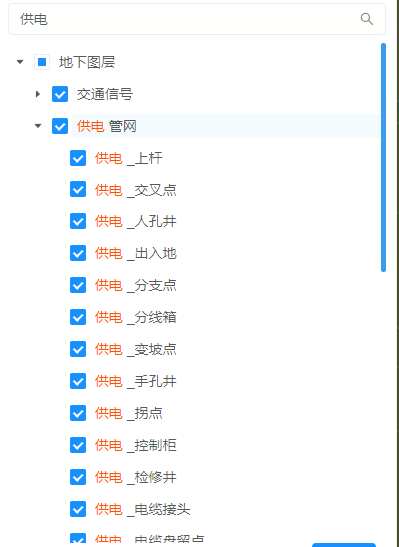
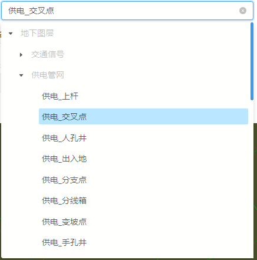
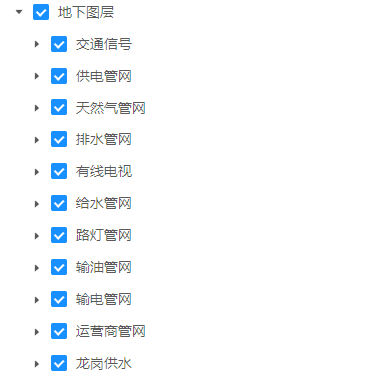

## 效果一览




## 引入
全局引入的情况下，直接使用即可
```vue
<template>
 <div>
   <municipal-layer props>
   </municipal-layer>
 </div>
</template>
```
按需引入
```vue
<template>
 <div>
   <municipal-layer props>
   </municipal-layer>
 </div>
</template>

<script>
import {MunicipalLayer} from 'municipal-cesium-components';
export default {
  components:{
    MunicipalLayer
  }
}
</script>
```

# 图层树工具

> 图层树，根据传入的通用配置中的图层树构造而成，支持自定义树的数据，支持根据传入的筛选规则选择性的展示树的节点，支持搜索功能

## 由layer自己生成树

> 1.customTreeData用于指定是否需要自定义树的数据,指定为false,代表需要layer自己生成树

> 2.checkedKeys,选中的项的key

> 3.layerGroup用于筛选树数据的规则 规则范式为{'父图层':subLayers:['子图层1','子图层2'] }

> 4.onLayerLoad事件在layer加载完毕之后返回layer的vue实例对象，该对象中包含了所有树的数据

```vue
<template>
  <municipal-layer :customTreeData="customTreeData"
                   :checkedKeys="checkedKeys"
                   :layerGroup="layerGroup"
                   @check="check"
                   @load="onLayerLoad">
  </municipal-layer>
</template>

<script>
export default {
  name: "panel",
  data() {
    return {
      customTreeData:false,
      checkedKeys:[],
      layerGroup:{
        '给水管网':{
          subLayers: ['给水_管段']
        }
      }
    };
  },
  methods:{
    check(checkKeys){
      this.checkedKeys=checkKeys;
    },
    onLayerLoad(payload){
      this.layerVm=payload;
    }
  }
};
</script>
```

## 自己传入树的数据

> 1.customTreeData用于指定是否需要自定义树的数据,指定为true,代表需要用户自己传入树的数据

> 2.checkedKeys,选中的项的key

> 3.layerData传入的树的数据，类型为数组，其中的对象必须包含title，children字段

> 4.onLayerLoad事件在layer加载完毕之后返回layer的vue实例对象，该对象中包含了所有树的数据

```vue
<template>
  <municipal-layer :customTreeData="customTreeData"
                   :checkedKeys="checkedKeys"
                   :layerData="layerData"
                   @check="check"
                   @load="onLayerLoad">
  </municipal-layer>
</template>

<script>
export default {
  name: "panel",
  data() {
    return {
      customTreeData:true,
      checkedKeys:[],
      layerData:[
        {
          title:'全部图层',
          Id:'0',
          children:[
            {
              title:'地上图层',
              Id:'0-0'
            },{
              title:'地下图层',
              Id:'0-1'
            }
          ]
        }
      ]
    };
  },
  methods:{
    check(checkKeys){
      this.checkedKeys=checkKeys;
    },
    onLayerLoad(payload){
      this.layerVm=payload;
    }
  }
};
</script>
```

::: warning layerGroup参数详细解释
1.关于图层树的数据来源

图层树的数据来源于在场景布置的时候，传入的commonConfig参数中的layerGroupNamesTree字段。
所以为了图层树的成功渲染，请务必配置该数据，commonConfig数据可以从中地市政5.0运维服务中获取

2.关于layerGroup如何对图层数据进行筛选

layerGroup需要去指定一个键值对形式的数据，比如我只想要地下管网下的全部图层，layerGroup需传入
```javascript
//根据图层名称进行匹配，如果不配置subLayer,就会默认展示该管网分组下的所有图层
layerGroup: {
        '地下管网':{}
}
```
渲染出的图层树效果


如果我想要具体到子图层，比如我只想要给水管网下的给水管段，layerGroup需传入
```javascript
//根据图层名称进行匹配，如果不配置subLayer,就会默认展示该管网分组下的所有图层
layerGroup: {
  '给水管网': {
    subLayers: ['给水管段']
  }
}
```
渲染出的图层树效果


如果想要展示全部管网图层树，不传layerGroup即可
*目前使用规则筛选图层树，只支持两层，有特殊的需求请使用layerData参数自行传入图层树数据

:::

## 事件

### `@load`

- **Description:** 在 Layer 加载完毕后发送该事件
- **Payload** `{ payload }`
- `payload` 图层树组件的vue实例

### `@unload`

- **Description:** 在 Layer 注销完毕后发送该事件
- **Payload** `{ payload }`
- `payload` 图层树组件的vue实例

### `@checked`

- **Description:** 在 Layer 注销完毕后发送该事件
- **Payload** `{ checkedKeys }`
- `checkedKeys` 勾选的树节点的key

### `@onExpand`

- **Description:** 在 Layer 注销完毕后发送该事件
- **Payload** `{ expandedKeys }`
- `expandedKeys` 展开的树节点的key

## 属性

### 属性说明

属性|说明|取值类型|默认值
--|:--:|:--:|:--:
vueKey|municipal-web-scene组件的 ID，当使用多个mapgis-web-scene组件时，需要指定该值，来唯一标识mapgis-web-scene组件|String|default vueIndex|当
vueIndex|municipal-web-scene 插槽中使用了多个相同组件时，例如多个 municipal-igs-doc-layer 组件，用来区分组件的标识符|Number|空
[panelProps](https://aalldd.github.io/vue-cesium-component/components/common/panel.html#属性)|见面板工具属性说明|Attr|见面板工具说明
layerData|生成的树的数据,每条数据中需包含title,children字段,指定了customTreeData为false的话，不要指定该属性|Array|空
loading|layer组件的等待状态|Boolean|false
checkedKeys|layer组件勾选的树节点的key|Array|[]
checkable|layer组件是否需要勾选框|Boolean|true
customTreeData|layer组件是否自定义树的数据|Boolean|false
layerGroup|layer组件筛选树节点的规则，具体数据结构见示例|Object|空
needSearch|是否需要搜索功能|Boolean|true
