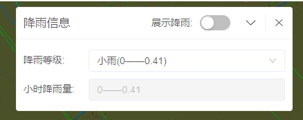

# 面板工具

> 所有功能的背景面板，具有折叠，拖动，关闭功能

## 效果一览



## 引入
全局引入的情况下，直接使用即可
```vue
<template>
  <municipal-panel props>
    some slots
  </municipal-panel>
</template>
```
按需引入
```vue
<template>
  <municipal-panel props>
    some slots
  </municipal-panel>
</template>

<script>
import {MunicipalPanel} from 'municipal-cesium-components';
export default {
  components:{
    MunicipalPanel
  }
}
</script>
```

## 基本用法

> 1.draggable 面板是否可拖动</br>
> 2.expandable 面板是否可折叠</br>
> 3.closable 面板是否可以关闭</br>
> 4.title 面板标题，注意标题不要为空字符串</br>
> 5.panelClassName 给面板自定义class类</br>
> 6.panelStyle 给面板自定义行内样式</br>
> 7.width 面板宽度,该设置优先级最大</br>
> 8.height 面板高度,该设置优先级最大</br>
```vue
<template>
  <municipal-panel :draggable="draggable"
                   v-if="panelVisible"
                   @onClose="onClose"
                   :title="title"
                   :closable="closable"
                   :need-expand="expandable"
                   :panel-style="panelStyle"
                   :width="400"
                   :height="400"
                   :panel-class-name="panelClassName">
    <template v-slot:content>
      <div>
        content
      </div>
    </template>
  </municipal-panel>
</template>

<script>
export default {
  name: "panel",
  data() {
    return {
      draggable: true,
      title:'面板',
      closable:true,
      expandable:true,
      panelStyle:{
        position:'absolute',
        top:'4em',
        right:'4em'
      },
      panelClassName:'panel',
      panelVisible:true
    };
  },
  methods:{
    onClose(){
      this.panelVisible=false
    }
  }
};
</script>

<style>
.panel{
  background-color: #000;
}
</style>
```

## 插槽

### 插槽content & extra
> extra插槽作用于面板标题栏右侧，紧贴关闭按钮，主要用于面板的其他操作，比如添加下拉选项，添加面板功能
> content插槽主要用于展示面板中的内容，比如表格，表单等

```vue
<template>
  <municipal-panel v-if="panelVisible">
    <template v-slot:extra>
      <div>
        extra //这里可以添加下拉框，比如数据切换，导入导出功能
      </div>
    </template>
    <template v-slot:content>
      <div>
        content //这里可以添加表格，表单或者其他操作控件
      </div>
    </template>
  </municipal-panel>
</template>

<script>
export default {
  name: "panel",
  data() {
    return {
      panelVisible:true
    };
  },
  methods:{
    onClose(){
      this.panelVisible=false
    }
  }
};
</script>

<style>
.panel{
  background-color: #000;
}
</style>
```

## 属性

### 属性说明

属性|说明|取值类型|默认值
--|:--:|:--:|:--:
draggable|面板是否可拖动|Boolean|true
expandable|面板是否可折叠|Boolean|true
closable|面板是否可关闭|Boolean|true
title|面板标题|String|'无标题'
panelClassName|面板样式类|String|''
panelStyle|面板行内样式|Object|{ width: '400px', position:'absolute', right:'2em', top:'2em' }
width|面板宽度|Number|400
height|面板高度|Number|400

## 事件

### `@onClose`

- **描述:** 在点击panel面板关闭按钮后发送该事件
- **回调参数** 无
