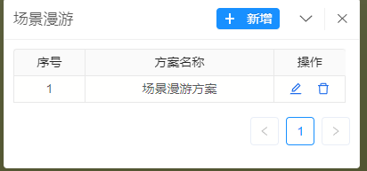

# planManager 方案管理面板

> 用于展示方案的公共组件，比如场景漫游方案，电子围栏方案

## 效果一览



## 引入
全局引入的情况下，直接使用即可
```vue
<template>
  <municipal-plan-mananger props>
    some slots
  </municipal-plan-mananger>
</template>
```
按需引入
```vue
<template>
  <municipal-plan-mananger props>
    some slots
  </municipal-plan-mananger>
</template>

<script>
import {MunicipalPlanManager} from 'municipal-cesium-components';
export default {
  components:{
    MunicipalPlanManager
  }
}
</script>
```

## 基本用法

```vue
<template>
  <municipal-plan-mananger v-if="planVisible" :title="titlePlan" @close="planVisible=false"
                           :dataSource="planData"
                           @addPlan="addPlan"
                           @onRowClick="previewPlan"
                           @modifyPlan="modifyPlan"
                           @deletePlan="deletePlan"
                           :loading="loading">
  </municipal-plan-mananger>
</template>

<script>

export default {
  data() {
    return {
      titlePlan: '方案管理',
      planVisible: true,
      loading: false,
      //全部的方案数据，从服务获取
      planData: []
    };
  },
  methods: {
    addPlan() {
    //  新增方案的回调，我们可以在这里改变状态，调用新增方案的服务接口
    },
    previewPlan(record) {
    //  点击表格行触发的事件
    },
    modifyPlan(record) {
    //  点击修改方案触发的事件
    },
    async deletePlan(record) {
    //  删除方案的回调，我们可以在这里调用删除接口
    }
  }
};
</script>

<style scoped>

</style>
```

## 属性

### 属性说明

属性|说明|取值类型|默认值
--|:--:|:--:|:--:
[panelProps](https://aalldd.github.io/vue-cesium-component/components/common/panel.html#属性)|见面板工具属性说明|Attr|见面板工具说明
titlePlan|方案名称|String|'漫游方案管理'
dataSource|方案数据|Array({planName:string,key:Number}) |[]


## 事件

### `@onClose`

- **描述:** 在点击panel面板关闭按钮后发送该事件
- **回调参数** 无

### `@addPlan`

- **描述:** 点击新增按钮触发事件
- **回调参数** 无

### `@modifyPlan`

- **描述:** 点击行上的修改按钮触发事件
- **回调参数** record,表格行数据

### `@modifyPlan`

- **描述:** 点击行上的修改按钮触发事件
- **回调参数** {record}
- **record** 表格行中的数据对象

### `@deletePlan`

- **描述:** 点击行上的删除按钮触发事件
- **回调参数** 无

### `@onRowClick`

- **描述:** 点击表格行发送该事件
- **回调参数** {record}
- **record** 表格行中的数据对象

