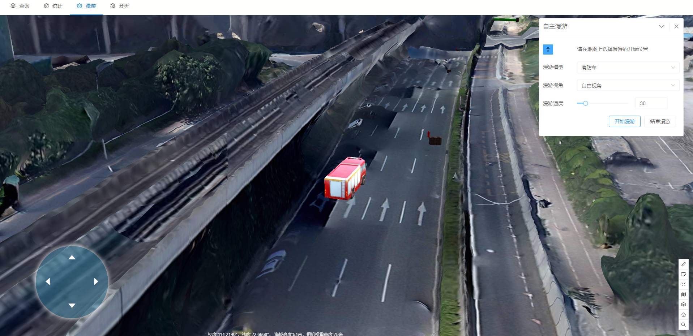

# 场景漫游

> municipal-auto-roam 自主漫游组件，让用户能够通过键盘去自由控制小车的移动

## 效果一览



## 基本用法

> 自主漫游用法，用户可以自己选择要操控的小车图片
```vue
<template>
  <municipal-auto-roam
    :modelList="modelList"
    title="自主漫游"
  ></municipal-auto-roam>
</template>
<script>
const baseUrl = "/static/cesium/model";
export default {
  name: "AutoRoamAna",
  data() {
    return {
      modelList: [
        {
          value: `${baseUrl}/xiaofangche.gltf`,
          name: "消防车",
        },
        {
          value: `${baseUrl}/car.gltf`,
          name: "小车",
        },
        {
          value: `${baseUrl}/tejingche.gltf`,
          name: "特警车",
        },
        {
          value: `${baseUrl}/person.gltf`,
          name: "人",
        },
      ],
    };
  },
};
</script>
```

## 属性

### 属性说明

属性|说明|取值类型|默认值
--|:--:|:--:|:--:
vueKey|municipal-web-scene组件的 ID，当使用多个mapgis-web-scene组件时，需要指定该值，来唯一标识mapgis-web-scene组件|String|default vueIndex|当
vueIndex|municipal-web-scene 插槽中使用了多个相同组件时，例如多个 municipal-igs-doc-layer 组件，用来区分组件的标识符|Number|空
[panelProps](https://aalldd.github.io/vue-cesium-component/components/common/panel.html#属性)|见面板工具属性说明|Attr|见面板工具说明
modelList|设置自主漫游三维模型路径|Array|[]


## 事件

### `@load`

- **描述:** 在 场景漫游组件 加载完毕后发送该事件
- **回调参数** `{ vm }`
- `vm` fixRoam vue实例对象

### `@unload`

- **描述:** 在 场景漫游组件 注销完毕后发送该事件
- **回调参数** `{ vm }`
- `vm` fixRoam vue实例对象


