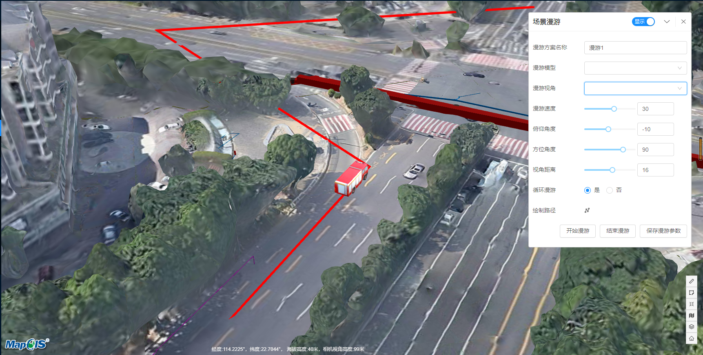

# 场景漫游

> municipal-fix-roam 场景漫游组件，提供了根据绘制路径，使三维模型在地图中漫游的功能，并能够根据参数去调整漫游效果，并返回漫游方案

## 效果一览



## 基本用法

> 1.基本的场景漫游组件用法，场景漫游组件需嵌套在m3d图层内，不传参就全使用默认值 其中draggable,title,closeable,expandable这四个属性用来控制场景漫游的面板是否可拖动，名称，可关闭，可展开
> </br>2.场景漫游必须提供三维模型的url参数 modelList,该参数用于渲染三维模型
> </br>3.场景漫游可以提供viewList参数用于控制视角的下拉选项,默认值见下方示例,<em>该参数最好不传，因为控制视角的value1,2,3是固定的</em>
```vue

<template>
  <municipal-commonLayer>
    <municipal-fix-roam title="场景漫游"
                        :draggable="true"
                        :closeable="true"
                        :expandable="true"
                        :panel-style="{width:'400px'}"
                        panel-class="fixedRoam"
                        :modelList="modelList"
                        :viewList="viewList"
    ></municipal-fix-roam>
  </municipal-commonLayer>
</template>

<script>
const baseUrl = '/static/cesium/model'
export default {
  name: "FixRoamAna",
  data() {
    return {
      modelList: [
        {
          value: `${baseUrl}/xiaofangche.gltf`,
          name: '消防车'
        },
        {
          value: `${baseUrl}/car.gltf`,
          name: '小车'
        }
      ],
      viewList:[{
        name: '自由视角',
        value: 1
      }, {
        name: '第一视角',
        value: 2
      }, {
        name: '上帝视角',
        value: 3
      }]
    };
  }
};
</script>

<style scoped>
.fixedRoam {
  /*  此处可对场景漫游面板自定义样式*/
  background: #1e6ceb;
}
</style>
```

## 自定义漫游参数展示(fixedRoamData)

> 1.开发者可以自己定义界面展示的漫游参数以及参数名称,每个参数对应的初始值</br>
> 2.注意参数格式需与示例中保持一致，且uniKey作为组件识别参数的唯一值，不可更改，否则会发生错误</br>
> 3.fixedRoamData内的<strong>参数释义</strong>:</br>

属性uniKey|说明|取值类型|默认值
--|:--:|:--:|:--:
title|漫游方案名称|String|场景漫游方案
model|漫游模型|String|空字符
view|漫游视角(1,2,3)分别代表自由视角，第一视角，上帝视角|Number|1
speed|漫游速度|Number|30
pitch|俯仰角度,视角与模型的俯仰角度|Number|-10 负数为俯视角
heading|朝向角度,视角与模型的左右偏转角|Number|90 90度为看模型的正后方
distance|视角距离，模型与视角的距离,单位米|Number|16
loop|是否循环漫游,如果为是,则会无限的漫游下去|String|是
path|漫游路径,开发者无需设置这里的value,保存数据的时候会自动填入绘制出来的坐标|Array|null

```html
<template>
  <municipal-fix-roam :modelList="modelList" :fixedRoamData="fixedRoamData" title="场景漫游"></municipal-fix-roam>
</template>
<script>
  const baseUrl='/static/cesium/model'
  export default {
    name: "FixRoamAna",
    data() {
      return {
        modelList: [
          {
            value:`${baseUrl}/xiaofangche.gltf`,
            name:'消防车'
          },
          {
            value:`${baseUrl}/car.gltf`,
            name:'小车'
          },{
            value:`${baseUrl}/tejingche.gltf`,
            name:'特警车'
          },{
            value:`${baseUrl}/person.gltf`,
            name:'人'
          }
        ],
        fixedRoamData:[
          {
            title: '漫游方案名称',
            value: '漫游1',
            uniKey: 'title'
          }
        ]
      };
    }
  };
</script>
```

## 保存漫游方案数据(saveRoam)

> 漫游实现之后，可以将漫游方案的数据保存下来，组件会返回当前漫游方案的数据，数据格式与fixedRoamData一致

```html
<template>
  <municipal-fix-roam :modelList="modelList" @saveRoam="saveRoam" title="场景漫游"></municipal-fix-roam>
</template>
<script>
  const baseUrl='/static/cesium/model'
  export default {
    name: "FixRoamAna",
    data() {
      return {
        modelList: [
          {
            value:`${baseUrl}/xiaofangche.gltf`,
            name:'消防车'
          },
          {
            value:`${baseUrl}/car.gltf`,
            name:'小车'
          }
        ]
      };
    },
    methods:{
        saveRoam(roamData) {
          console.log(roamData)
        }
    }
  };
</script>
```

## 自定义UI界面(uiControlled)

> 开发者如果不喜欢组件的原生界面风格，可以使用vue插槽的形式自己开发界面
> 开发者可以通过onload事件获取到场景漫游组件的所有数据，接口

```html
<template>
  <municipal-fix-roam :modelList="modelList" :uiControlled="true" @onload="getFixedVm">
    <div>
      ...自定义界面
      <button @click="startRoam"></button>
    </div>
  </municipal-fix-roam>
</template>
<script>
  const baseUrl='/static/cesium/model'
  export default {
    name: "FixRoamAna",
    data() {
      return {
        modelList: [
          {
            value:`${baseUrl}/xiaofangche.gltf`,
            name:'消防车'
          },
          {
            value:`${baseUrl}/car.gltf`,
            name:'小车'
          }
        ]
      };
    },
    methods:{
      getFixedVm(payload) {
         this.fixedVm=payload
      },
      startRoam(){
          //调用组件内的实例方法实现漫游
          this.fixedVm.startRoam()
      }
    }
  };
</script>
```

## 属性

### 属性说明

属性|说明|取值类型|默认值
--|:--:|:--:|:--:
vueKey|municipal-web-scene组件的 ID，当使用多个mapgis-web-scene组件时，需要指定该值，来唯一标识mapgis-web-scene组件|String|default vueIndex|当
vueIndex|municipal-web-scene 插槽中使用了多个相同组件时，例如多个 municipal-igs-doc-layer 组件，用来区分组件的标识符|Number|空
[panelProps](https://aalldd.github.io/vue-cesium-component/components/common/panel.html#属性)|见面板工具属性说明|Attr|见面板工具说明
modelList|设置场景漫游三维模型路径|Array|[]
viewList|设置场景漫游视角属性,目前支持三种,value值固定为1,2,3|Array|见示例
fixedRoamData|设置场景漫游参数名称以及默认值|Array|见示例
uiControlled|设置场景漫游是否需要自定义ui样式|Boolean|false


## 事件

### `@load`

- **描述:** 在 场景漫游组件 加载完毕后发送该事件
- **回调参数** `{ vm }`
- `vm` fixRoam vue实例对象

### `@unload`

- **描述:** 在 场景漫游组件 注销完毕后发送该事件
- **回调参数** `{ vm }`
- `vm` fixRoam vue实例对象

### `@saveRoam`

- **描述:** 在 场景漫游结束后发送该事件
- **回调参数** `{ fixedRoamData }`
- `fixedRoamData` 返回的数据格式见示例:fixedRoamData


