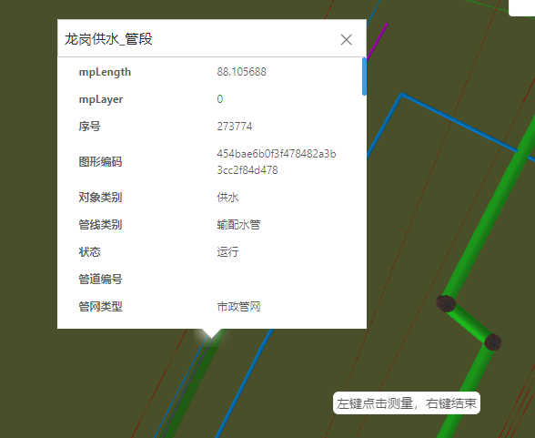

# 地图复位

> municipal-click-query 点击查询组件,结合了三维的popup,用户点击一个管点或者管段，管段会实现变色，并将查询到的管网信息显示在popup上

## 效果一览



## 基本用法

> 基本的点击查询使用方法,点击查询所需的数据需要从服务单独调用

```vue

<template>
  <municipal-click-query :clickQueryData="clickQueryData"
                         :popupOffset="popupOffset"
                         @clickQuery="clickQuery"></municipal-click-query>
</template>

<script>
import Store from "@/store/store";
export default {
  data() {
    return {
      //天地图地址
      popupOffset:[0,0],
      clickQueryData:[],
    };
  },
  methods:{
    async clickQuery(params){
      const store = new Store();
      const data = await store.getGeometry(params);
      this.clickQueryData = data;
    }
  }
};
</script>
```

## 如何修改popup的样式
> 支持直接用css样式表去修改popup的样式，所有关于popup样式的class都由mapgis开头

## 属性

### 属性说明

属性|说明|取值类型|默认值
--|:--:|:--:|:--:
vueKey|mapgis-web-scene组件的 ID，当使用多个mapgis-web-scene组件时，需要指定该值，来唯一标识mapgis-web-scene组件|String|default
vueIndex|当 mapgis-web-scene 插槽中使用了多个相同组件时，例如多个 mapgis-3d-igs-doc-layer 组件，用来区分组件的标识符|Number|空
cameraView|复位坐标&复位相机视角|Object|空


