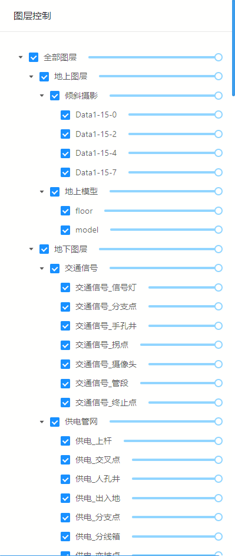

# 图层控制

> municipal-layer-control 图层控制组件

## 效果一览



## 基本用法

基本的图层控制组件用法

> 只需要引入组件即可使用，因为图层数据是从baseMap类型的组件中的commonConfig中传入，如果不想要使用commonConfig中的图层树，也可以自己传入图层树

```vue

<template>
  <municipal-layer-control></municipal-layer-control>
</template>
```

## 属性

### 属性说明

属性|说明|取值类型|默认值
--|:--:|:--:|:--:
vueKey|mapgis-web-scene组件的 ID，当使用多个mapgis-web-scene组件时，需要指定该值，来唯一标识mapgis-web-scene组件|String|default
vueIndex|当 mapgis-web-scene 插槽中使用了多个相同组件时，例如多个 mapgis-3d-igs-doc-layer 组件，用来区分组件的标识符|Number|空
title|图层控制面板名称|String|图层控制
layerGroupTree|图层控制树|Array|[]


