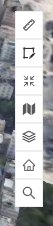

# 地图工具
> municipal-tool 工具组件，整合了目前组件库中的所有工具，包括量测，绘制，全屏，天地图，图层控制，复位，点击查询工具

## 效果一览



## 引入
全局引入的情况下，直接使用即可
```vue
<template>
  <municipal-tool props></municipal-tool>
</template>
```
按需引入
```vue
<template>
  <municipal-cursor-tip props>
    some slots
  </municipal-cursor-tip>
</template>

<script>
import {MunicipalCursorTip} from 'municipal-cesium-components';
export default {
  components:{
    MunicipalCursorTip
  }
}
</script>
```

## 基本用法
> 将工具组件功能全部用上的最简单用法,需写在地图场景组件内
```vue
<template>
  <municipal-common-layer {...commonLayerProps}>
    <municipal-tool :wmtsMap="wmtsMap" :popupOffset="popupOffset" :cameraView="cameraView" @clickQuery="clickQuery"
                    :clickQueryData="clickQueryData"></municipal-tool>
  </municipal-common-layer>
</template>

<script >
import Store from "@/store/store";
export default {
  data(){
    return {
      //天地图信息
      wmtsMap: {
        url: 'http://t0.tianditu.com/DataServer?T=vec_c&X={x}&Y={y}&L={l}',
        token: '79d9c78880a541ad34a010976a244ec2',
        ptype: 'img'
      },
      //复位的相机坐标以及视角
      cameraView: {
        destination: {
          x: -2416948.392038159,
          y: 5372543.175879652,
          z: 2444631.2541255946
        },
        orientation: {
          heading: 0.08752,
          pitch: -1.57,
          roll: 0
        }
      },
      popupOffset: [0, 0],
      clickQueryData:[]
    }
  },
  methods:{
    //点击查询，会将需要的查询参数全部返回出来,接口getGeometry的实现可以参考我的测试代码
    async clickQuery(param) {
      const store = new Store();
      const data = await store.getGeometry(param);
      this.clickQueryData = data;
    }
  }
}
</script>
```

## 属性

### `toolComponents`

- **类型:** `Array`
- **侦听属性**
- **默认值:** `['measure', 'draw', 'fullScreen', 'tian', 'home']`
- **描述:**
  > 需要使用的工具，包括量测，绘制，全屏，天地图显示，复位等,不传默认使用全部

### `wmtsMap`

- **类型:** `Object`
- **侦听属性**
- **默认值:** 无
- **描述:**
  > 用于控制天地图显示的天地图对象，天地图对象由组件municipal-wmtsDocLayer加载的回调事件返回

### `popupOffset`

- **类型:** `Array(Number)`
- **侦听属性**
- **默认值:** [0,0]
- **描述:**
  > 点击查询弹出框的偏移坐标

### `clickQueryData`

- **类型:** `Array`
- **侦听属性**
- **默认值:** []
- **描述:**
  > 点击查询出的数据，需从对应的服务获取回传到组件，数据格式参考我的测试代码

### `cameraView`

- **类型:** `Object`
- **侦听属性**
- **默认值:** 无
- **描述:**
  > 用于控制地图复位的复位坐标，
  > 数据格式{ destination: { x: -2416948.392038159, y: 5372543.175879652, z: 2444631.2541255946 },
  orientation: { heading: 0.08752, pitch: -0.689042, roll: 0.0002114284469649675 } }
  > destination用于复位坐标，orientation用于控制相机视角

### `vueKey`

- **类型:** `String`
- **可选**
- **非侦听属性**
- **默认值:** `default`
- **描述:**
  > mapgis-web-scene 组件的 ID，当使用多个 mapgis-web-scene 组件时，需要指定该值，来唯一标识 mapgis-web-scene 组件， <br/>
  > 同时 mapgis-web-scene 插槽中的组件也需要传入相同的 vueKey，让组件知道应该作用于哪一个 mapgis-web-scene。

### `vueIndex`

- **类型:** `Number`
- **可选**
- **非侦听属性**
- **描述:**
  > 当 mapgis-web-scene 插槽中使用了多个相同组件时，例如多个 mapgis-3d-igs-doc-layer 组件，用来区分组件的标识符。


## 事件

### `@drawCreate`

- **Description:** 在 Draw 绘制图形完毕后发送该事件
- **Payload** `{ cartoCoordinate ,degreeCoordinate ,webGlobe}`
- `cartoCoordinate` 笛卡尔坐标集合
- `degreeCoordinate` 经纬度坐标集合
- `webGlobe` 当前绘制组件所在的 webGlobe

### `@measured`

- **描述:** 在 Measure 测量完毕后发送该事件
  > 直线测量结果：Array,[起始点（0），第一次点击距离起始点的长度，第二次点击距离起始点的长度，...，右键结束测量后，最后一个点距离起始点的长度]，
  > 单位：千米 <br/>
  > 面积测量结果：Number,测量的面积，单位：平方米 <br/>
  > 三角测量结果：Object,{horizontalDiatance（水平距离）,slantDiatance（直线距离）,verticalDiatance（高差）} <br/>
  > 坡度测量：number，坡度，单位：度
- **回调参数** `{ result }`

