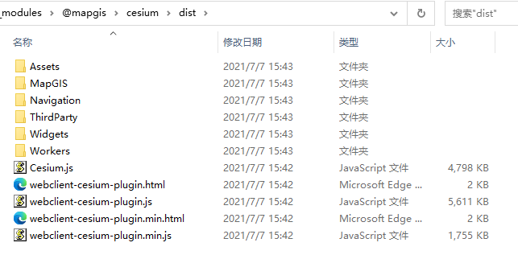

# 快速上手

``` vue
<template>
  <municipal-common-layer :height="mapHeight"
                         class="mapWrapper"
                         :plugin-path="pluginPath"
                         :lib-path="libPath"
                         :load="handleLoad"
                         :m3dInfos="m3dInfos"
  >
    <municipal-tool :wmtsMap="wmtsMap" :cameraView="cameraView"></municipal-tool>
    <municipal-flood></municipal-flood>
  </municipal-common-layer>
</template>

<script>
export default {
  data() {
    return {
      // 天地图地址
      pluginPath: '/static/cesium/webclient-cesium-plugin.min.js',
      libPath: '/static/cesium/Cesium.js',
      m3dInfos: [
        {
          maximumMemoryUsage: 1024,
          url: 'http://192.168.12.200:6163/igs/rest/g3d/lgzh0902',
          layers: '',
          vueIndex: '0'
        }
      ],
      wmtsMap:null,
      cameraView: {
        destination: {
          x: -2416948.392038159,
          y: 5372543.175879652,
          z: 2444631.2541255946
        },
        orientation: {
          heading: 0.08752,
          pitch: -0.689042,
          roll: 0.0002114284469649675
        }
      }
    };
  },
  computed:{
    mapHeight(){
      return document.body.clientHeight
    }
  },
  methods: {
    handleLoad(payload) {
      const {component: {webGlobe}, Cesium, CesiumZondy} = payload;
      window.webGlobe = webGlobe;
      window.Cesium = Cesium;
      window.CesiumZondy = CesiumZondy;
    },
    onM3dLoad(payload) {
      console.log(payload);
    },
    getWmtsInfo(payload) {
      this.wmtsMap = payload;
    }
  }
};
</script>
```

## 安装

### ES6 方式
为了节省打包体积,municipal-cesium-components包对应的依赖需用户手动安装并引入：
```bash
安装mapgis-vue-ceisium以及对应的依赖:
npm install municipal-cesium-components ant-design-vue vue-draggable-resizable @turf/turf @mapgis/webclient-vue-cesium @mapgis/webclient-vue-ui
# 或者
yarn add municipal-cesium-components ant-design-vue vue-draggable-resizable @turf/turf @mapgis/webclient-vue-cesium @mapgis/webclient-vue-ui
```

在 main.js 中全局引入组件

```js
import MunicipalCesium from 'municipal-cesium-components'
import 'municipal-cesium-components/dist/municipal-vue-cesium.css';
import 'ant-design-vue/dist/antd.css';
import '@mapgis/webclient-vue-ui/dist-libs/webclient-vue-ui.css';
import '@mapgis/webclient-vue-cesium/dist-libs/webclient-vue-cesium.css';
import VueCesium from '@mapgis/webclient-vue-cesium';
import MapgisUi from '@mapgis/webclient-vue-ui';
import Antd from 'ant-design-vue';
import App from './App.vue';

Vue.use(MunicipalCesium)
Vue.use(VueCesium);
Vue.use(Antd);
Vue.use(MapgisUi);
```

在 组件或者main.js 中按需引入组件

```js
// main.js
import {MunicipalCommonLayer} from 'municipal-cesium-components/dist/webclient-vue-cesium.umd.min'
import 'mapgis-cesium-components/dist/webclient-vue-cesium.css'
import 'municipal-cesium-components/dist/municipal-vue-cesium.css';
import 'ant-design-vue/dist/antd.css';
import '@mapgis/webclient-vue-ui/dist-libs/webclient-vue-ui.css';
import '@mapgis/webclient-vue-cesium/dist-libs/webclient-vue-cesium.css';
import VueCesium from '@mapgis/webclient-vue-cesium';
import MapgisUi from '@mapgis/webclient-vue-ui';
import Antd from 'ant-design-vue';
Vue.component('municipal-commonLayer',MunicipalCommonLayer)
Vue.use(VueCesium);
Vue.use(Antd);
Vue.use(MapgisUi);
```

### Ceisum 库引入

municipal-cesium-components 是基于webclient-vue-cesium的一层封装，底层依赖 `@mapgis/cesium`。 除了本身需要安装以外，你还需要拷贝@mapgis/cesium

::: tip 为什么要使用@mapgis/cesium 由于 cesium 本身`涉及大量的纹理材质以及多线程Worker`， 公司内部修改版实现`M3D格式`， M3D`不是`3dtile，是中地数码自己独特的格式，与开源的
3dtile 不是一种格式。很多高级分析功能`只能作用于M3D`,而不支持 3d tile.
:::



请将上述 cesium 文件夹统一拷贝到你的 vue 工程对应的 public 文件夹下的某个目录中，记录对应的路径为

```sh
# quasar 的静态资源目录为src/static
# 常见的静态资源目录为 public
# 主Cesium主体路径
$path/cesium/dist/Cesium.js # public/cesium/dist/Cesium.js
# Cesium拓展插件路径
$path/cesium/dist/webclient-cesium-plugins.js # public/cesium/dist/webclient-cesium-plugins.js
```

municipal-cesium-components 组件使用以上两个文件的方式如下所示:

```vue
<template>
  <municipal-common-layer :height="mapHeight"
                         class="mapWrapper"
                         :plugin-path="pluginPath"
                         :lib-path="libPath"
                         :load="handleLoad"
                         :m3dInfos="m3dInfos"
  >
  </municipal-common-layer>
</template>
```

> 如果在浏览器中 访问 `http://localhost:xxxx/$path/cesium/dist/Cesium.js` 成功则说明整个 Cesium 的环境准备已经完毕。

::: tip 为什么要拷贝@mapgis/cesium 由于原生的 Cesium 在支持 Webpack 编译的时候也是采取的 copy 插件来执行对应的文件夹拷贝操作。 因此为了统一处理，这里`统一不采取`手动修改
webpack.config 的方式，而是将 cesium 的所有文件放在 public 或者 asset 的某个目录下，自己`手动实现`静态资料的拷贝
:::

### vueconfig配置
::: tip 我们在项目中使用时如果需要访问到静态资源服务器上的cesium，需要配置vue的代理
```editorconfig
module.exports = {
  ...other options,
  devServer: {
    proxy: {
      '/': {
        target: '~你的静态资源服务地址',
        changeOrigin: true,
        pathRewrite: {
          '/': ''
        }
      }
    }
  }
};
```
